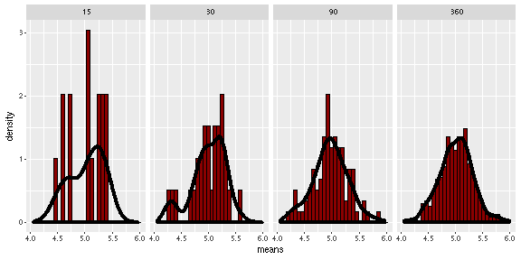

## Introduction

This application focuses to elucidate the Central Limit Theorem (CLT) statement, through an interactive interface.

### Outline:  
  1. Theory of CLT 
  2. Implementation with Shiny
  3. Example

---

## 1. Theory of CLT

- CLT is one of the most fundamental statistical theorems.
- CLT states that even though we might not know the shape of our data distribution, we can use the sampling distribution as if it was normal.
- Precisely: Draw a Simple Random Sample (SRS) of size n from any population with mean μ and finite standard deviation σ. When n is large, the sampling distribution of the sample mean is approximately Normal: $$\\bar{x} \\sim N(μ, \\frac{σ}{\\sqrt(n)})$$

---

## 2. Implementation with Shiny

- R Shiny package was used for the application construction.

- The user is able to test the CLT for various distributions (Normal, Poisson, etc), defining the respective parameters and the sample sizes.

- The application code is available at github repository: https://github.com/thodk/clt_app

- The application is available at: https://thodk.shinyapps.io/clt_app/

---

## 3. Example

- Assume that a random variable follows Chi-squared distribution with degrees of freedom equal to 5.

- The figure below, indicates the distribution of n-size samples of the random variable mean (n = 15, 30, 90, 360).

- It is obvious that, the greater the sample size, the more approximation to normality the distribution has.

---
